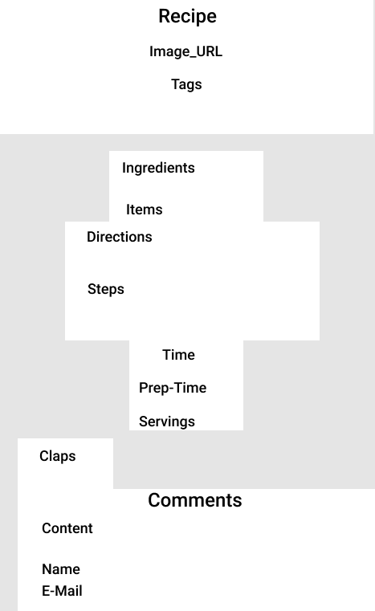
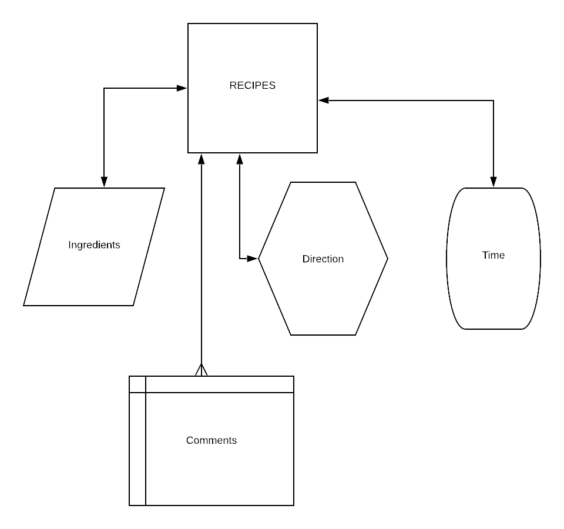

# recipe-app

The purpose of this webapp is to provide a database of traditional haitian recipes. It can serve as a reference for an amateur cook or a professional chef. In the future, I want to make it available as an API. 

## Technology used
* SQL
* Django
* Python
* React
* Javascript
* CSS
  
 ## Link to deployed app 

[KreyolRecipe](https://kreyol-recipe.herokuapp.com/)

## Wireframe

Format: 

## ERD

Format: 

